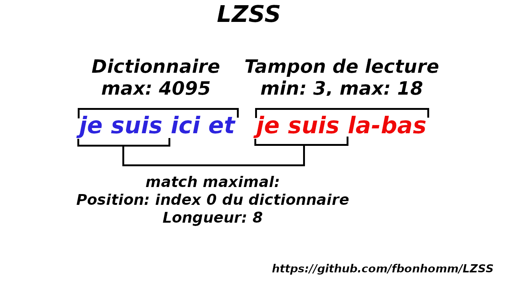

The [LZSS](https://en.wikipedia.org/wiki/Lempel%E2%80%93Ziv%E2%80%93Storer%E2%80%93Szymanski) (Lempel-Ziv-Storer-Szymanski) is a [lossless compression](https://en.wikipedia.org/wiki/Lossless_compression) algorithm.

The algorithm is a LZ77 improvement.

It use window sliding method.

There are multiples modes, the 0 mode explain the default LZSS working.

The other modes are variants.

The examples are in french but it's not hard to understand. ;)

## Table of Contents
1. [Mode0](#mode0)
2. [Mode1](#mode1)
3. [PositionMode](#positionmode)

## Mode0

#### Example

`je suis ici et je suis là-bas => je suis ici et je suis la-bas`

Example with this string : `je suis ici et je suis la-bas` length 29.

The encoded string : `je suis ici et (0,8)la-bas` length 23. (+3 flags bytes so 26)

The pattern research can overlap the read buffer.


The encoding is done most of the time on 2 bytes : 

    - 12 bits for the position
    - 4 bits for the length

1 flag bit is positioned to front each character or encoding for recognize while the decompression.

A letter does 8 bits but with the bit flag, it makes 17 bits. 

So no-encoding is more bulky that the original file, we must catch up on the encoding.

The encoding does 16 bits(12 bits of position and 4 bits of length) + 1 flag bit so 17 bits.


The position bits defined the dictionary size.
```
12 bits = 4095
```

The length bits defined the read buffer size.
```
4 bits = 15
```

But the LZSS is a minimum matching that is 3 by default, so the read buffer goes from [0;15] to [3;18].

The read buffer size goes to 18, 3 will be remove the compression then 3 will be add while decompression.

Compression:
```
18 = 01001 - 3 = 1111 = 4 bits 
```

Decompression:
```
15 = 1111 + 3 = 01001 = 18 
```


 


## Mode1


Here is a variant that requires less resources, so more faster to compress and decompress.

The principle is the same, but instead of putting a flag to each byte or encoding, they are grouped together. 


## PositionMode

There are mainly 2 forms of counting the position.

What I call `absolute` counts from the beginning of the dictionary as the example above.

```
Example with the string : `je suis ici et je suis la-bas` length 29.

                     | - 8 - |
The encoded string : `je suis ici et (0,8)la-bas` length 23. (+3 flags bytes so 26)
                     |
                     0
```

And the `relative` format counts from current index.

```
Example with the string : `je suis ici et je suis la-bas` length 29.

                     | - 8 - |
The encoded string : `je suis ici et (15,8)la-bas` length 23. (+3 flags bytes so 26)
                     | ---- 15 ---- |
```
