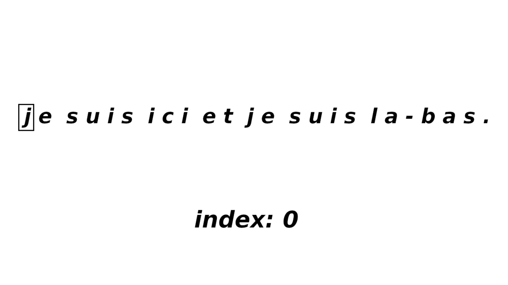
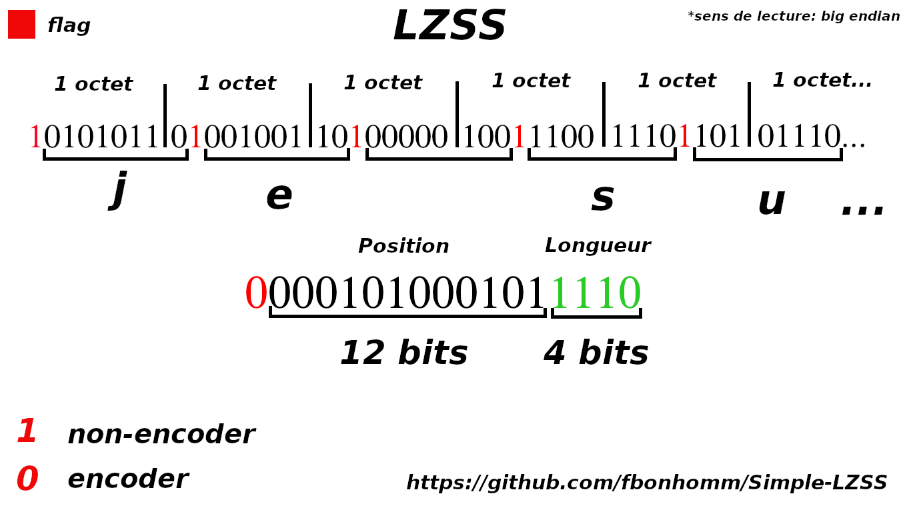
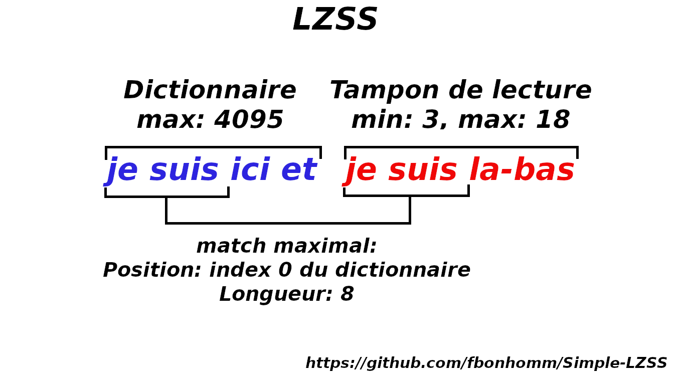
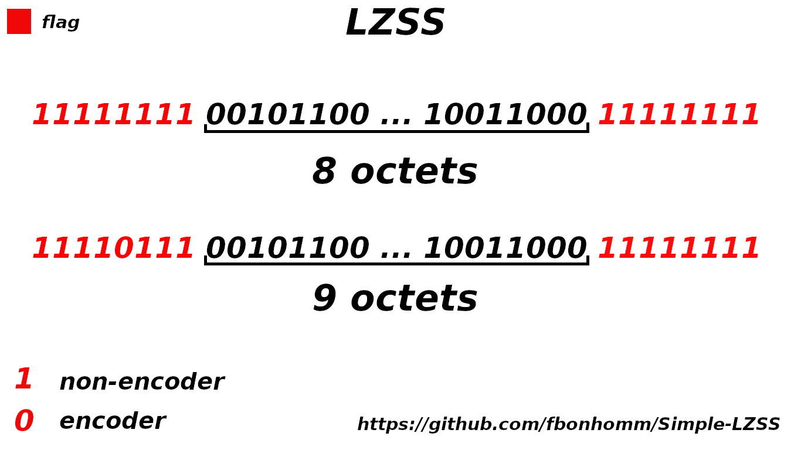

Le [LZSS](https://fr.wikipedia.org/wiki/LZSS) (Lempel-Ziv-Storer-Szymanski) est un algorithme de [compression sans perte](https://fr.wikipedia.org/wiki/Algorithme_de_compression_sans_perte).

Il utilise la methode de fenetre glissante.

Il y a plusieurs mode, le mode 0 explique le fonctionnement du LZSS par default.

Les autres modes sont des variantes.

## Table of Contents
1. [Mode0](#mode0)
2. [Mode1](#mode1)
2. [Mode2](#mode2)

## Mode0

#### Example
exemple avec la phrase: "je suis ici et je suis la-bas" de 29 .

la phrase encodee: "je suis ici et (0,8)la-bas" qui fait 23. (+3 octet de flags donc 26) 

L'agorithme est une amelioration du lz77.



L'encodage se fait la plus part de temps sur 2 Octet:

    - 12 bits pour la position
    - 4 bits pour la longueur

Un bit de flag est positionner devant chaque caractere ou encodage pour le reconnaitre pendant le decompression.

Un caractere fait 8 bits mais avec le bit de flag, il en fait 9 bits.

Donc le non-encodage est plus volumineux que le fichier original, il faut donc ce rattraper sur l'encodage.

L'ecodage fait 16 bits(12 bits de position et 4 bits de longueur) + 1 bit de flags soit 17 bits.




Les bits de position definie la taille du buffer de recherche (ou dictionnaire).
```
12 bits = 4095 soit la taille du buffer
```

Les bits de longueur definie la taille du tampon de lecture.
```
4 bits = 15 soit la taille du tampon de lecture
```
Mais le LZSS a un minimum de match qui est 3 par defaut, alors le tampon de lecture passe de [0;15] a [3;18].

La taille du tampon passe a 18, 3 sera enlever de la compression et 3 ajouter lors de la decompression.

Compression:
```
18 = 01001 - 3 = 1111 = 4 bits 
```

Decompression:
```
15 = 1111 + 3 = 01001 = 18, ont retrouve la bonne taille encoder 
```

 

## Mode1

Voici une variante qui demande moins de ressources, donc plus rapide a compresser et decompresser.

Pas besoin de garder de nombre de bits pris par l'ancien octet.

Le principe est le meme, mais au lieu de mettre un flag a chaque octet, on les regroupe.

```
11111111 si cette octet est present au debut du fichier, alors les 8 prochains octets sont non-encoded
``` 


