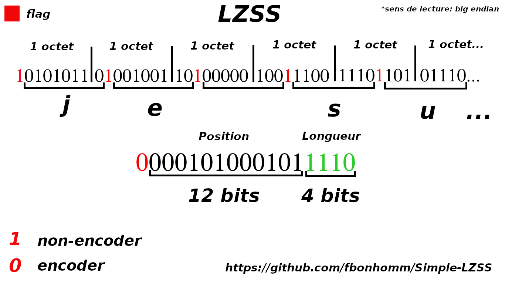
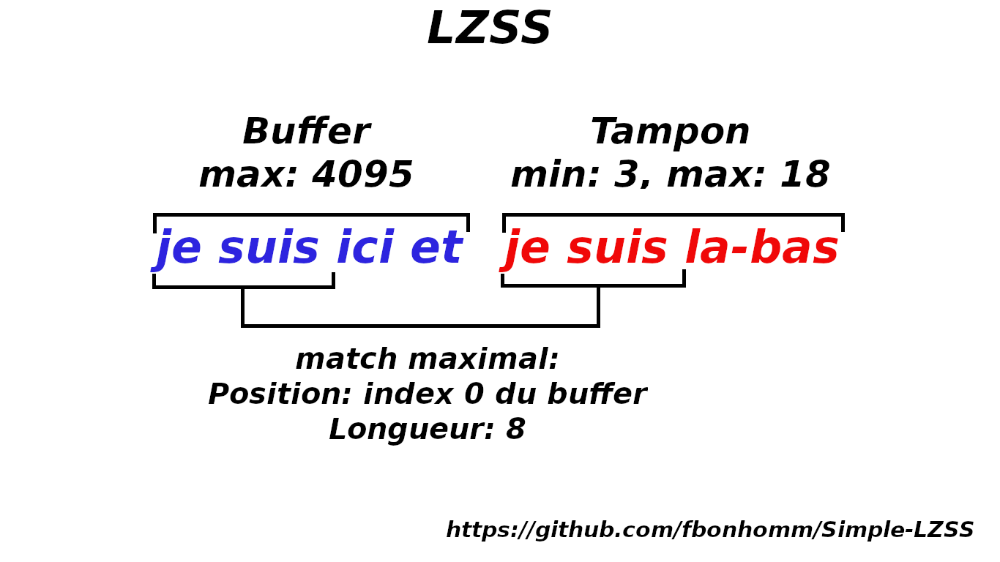

# Simple-LZSS

Simple LZSS implementation in Go

## Usage
```go
import "github.com/fbonhomm/Simple-LZSS/source"

var Lzss = source.LZSS{}

dataCompress := Lzss.Compress([]byte("..."))

rawData := Lzss.Decompress(dataCompress)
```

## LZSS Explications

Le [LZSS](https://fr.wikipedia.org/wiki/LZSS) (Lempel-Ziv-Storer-Szymanski) est un algorithme de [compression sans perte](https://fr.wikipedia.org/wiki/Algorithme_de_compression_sans_perte).

Il utilise la methode de fenetre glissante.

#### Example
exemple avec la phrase: "je suis ici et je suis la-bas" de 29 .

la phrase encodee: "je suis ici et (0,12)la-bas" qui fait 23. (+3 octet de flags donc 26)

L'encodage se fait la plus part de temps sur 2 Octet(12 bits pour la position et 4 bit pour la longueur) 

L'agorithme est une amelioration du lz77.

L'encodage par defaut est:

    - 12 bits pour la position
    - 4 bits pour la longueur

Un bit de flag est positionner devant chaque caractere ou encode.




Les bits de position definie la taille du buffer de recherche (ou dictionnaire).
```
12 bits = 4095 soit la taille du buffer
```

Les bits de longueur definie la taille du tampon de lecture.
```
4 bits = 15 soit la taille du tampon de lecture
```
Mais le LZSS a un minum de match qui est 3 par defaut, alors le tampon de lecture oasse de [0;15] a [3;18].

La taille du tampon passe a 18, 3 sera enlever de la compression et 3 ajouter lors de la decompression.

Compression:
```
18 = 01001 - 3 = 1111 = 4 bits 
```

Decompression:
```
15 = 1111 + 3 = 01001 = 18, ont retrouve la bonne taille encoder 
```


